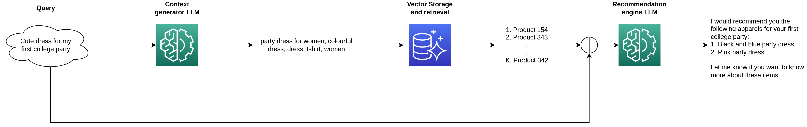
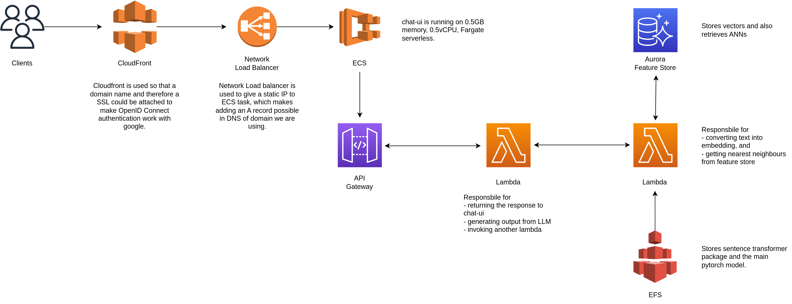

# Apparel-Chat-Recommender

A session-aware fashion recommendation chatbot using open-source LLMs like ChatGPT, offering personalized styling advice through natural conversation.

*Figure 1: System Design - Local Jupyter Notebook Development Flow and Recommendation Engine*

## Repository Contents

### Environment File
- `env.yaml`: Environment file for Conda package manager. Use this for local development on Jupyter Notebook.

### Text Prompts
- `first_llm_prompt`: Text prompt for the first Large Language Model.
- `second_llm_prompt`: Text prompt for the second Large Language Model.

### Jupyter Notebooks
1. `myntra_dataset_feature-store_creation.ipynb`: Prepares the dataset and populates the feature store.

2. `recommender-with-both-llms.ipynb`: Contains the code for the recommendation system, querying from both Large Language Models, and how to interact with them.

## System Design

### Local Development Flow and Recommendation Engine

### Deployed Recommendation Engine on AWS

## Getting Started

1. Clone the repository: `git clone https://github.com/your-username/recommender-chatbot-llms.git`
2. Create a Conda environment: `conda env create -f env.yaml`
3. Activate the environment: `conda activate your-environment-name`
4. Open Jupyter Notebook and run the notebooks in the specified order.
